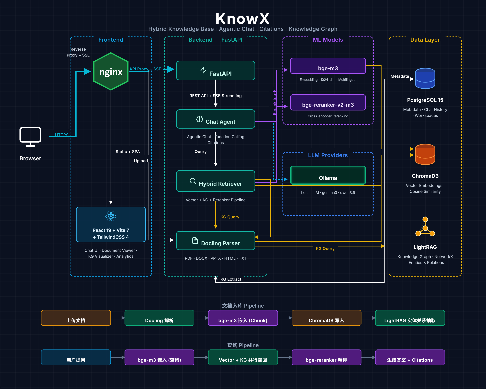

<div align="center">

# KnowX

### 面向研发文献与实验 SOP 的企业级知识库 RAG 系统

[](https://python.org)
[](https://react.dev)
[](https://fastapi.tiangolo.com)
[](https://docker.com)

**结构化解析 · 混合检索 · 知识图谱 · 引用溯源 · 多租户隔离**

</div>

---

## 项目定位

KnowX 是一个面向研发人员的企业级知识库问答系统，目标场景是：研发人员在项目中需要反复检索论文、技术报告、实验 SOP、试剂配比表等资料，而传统 RAG 在这类需求上存在明显短板。

|维度|传统 RAG|KnowX|
|-|-|-|
|文档解析|纯文本抽取，表格和版面信息丢失|Docling/Marker 结构化解析，保留页码、标题层级、表格、图片|
|多媒体信息|图片、表格常被忽略|表格/图片 caption 写入 chunk，纳入向量检索|
|检索策略|单向量相似度|向量 over-fetch + KG 上下文 + Cross-Encoder rerank|
|可追溯性|引用弱或无引用|引用 ID、页码、标题路径、文档跳转|
|工程落地|单用户 Demo 居多|鉴权、租户隔离、限流、Celery 队列、MCP Server|
|部署形态|依赖云 API|支持本地 Qwen/Ollama|

> **为什么面向研发场景要单独强调表格？** 生物/化学实验 SOP 中，关键参数（试剂比例、温度、时间、批次）大量存于表格。一旦问答系统丢失表格结构或生成无来源结论，可能直接影响实验准确性。KnowX 的核心设计目标是"可审计的回答"，而不仅仅是"能聊天"。

---

## 产品演示

<div align="center">

<!-- 内嵌播放须使用 GitHub 编辑器拖放上传后生成的 user-attachments 链接，仓库内 mp4 / LFS / Release 链接均无法在 README 内嵌播放 -->
<video src="https://github.com/user-attachments/assets/REPLACE_WITH_YOUR_ASSET_ID" controls width="90%"></video>

</div>

---

## 系统架构

<div align="center">



</div>

架构分为五个层次：**前端工作台** → **FastAPI 接口层（JWT 鉴权）** → **Celery 异步队列（解析/索引/建图）** → **存储层（PostgreSQL + ChromaDB + LightRAG）** → **模型层（Embedding + Reranker + LLM）**。

**主链路说明：**

1. 用户登录后创建知识库，上传文档（可附加 `custom_metadata`）。
2. 后端将解析任务投递到 `parse_index_queue`，Celery Worker 异步执行。
3. 解析器统一输出 `ParsedDocument`：Markdown、chunk、图片、表格、页码、标题路径。
4. 系统对 chunk 去噪去重，图片/表格 caption 增强后写入 ChromaDB；同步构建 LightRAG 知识图谱。
5. 查询时并行执行向量召回与 KG 上下文获取，Cross-Encoder 精排后交给 LLM 生成带引用答案。
6. 前端展示引用来源卡片、可跳转的文档阅读器和知识图谱可视化。

</details>

---

## 核心设计亮点

### 1. 双解析器 + 统一 `ParsedDocument` 契约

KnowX 支持 `Docling`（默认）和 `Marker` 两套解析器。

**设计重点不只是"支持两种解析器"，而是建立了统一输出契约：**

```
Docling  ──┐
            ├─→ BaseDocumentParser.parse() → ParsedDocument
Marker   ──┘        ↓
                去重 → Embedding → ChromaDB 入库
                      ↓
                  LightRAG 建图
```

无论上游使用哪种解析器，下游索引和检索链路完全一致，**避免了大量解析器分支散落在业务代码中**，系统可维护性显著提升。

|场景|推荐解析器|原因|
|-|-|-|
|表格密集、页码/标题结构重要|Docling（默认）|HybridChunker，结构化程度高|
|公式/LaTeX 敏感，或显存紧张|Marker|Surya 引擎，~2–4GB VRAM（vs Docling ~18–20GB）|

---

### 2. 表格与图片纳入向量检索

传统 RAG 常将图片和表格丢弃，KnowX 通过以下方式让多媒体内容可被语义检索：

**表格处理流程：**

1. 解析器将表格导出为结构化 Markdown（保留行列维度）
2. LLM 对每张表格生成摘要：用途、关键列、核心数值
3. 摘要写回对应 chunk 文本 → 参与 embedding

**图片处理流程：**

1. 解析器抽取图片（每文档上限 50 张）
2. 视觉 LLM 生成 caption（具体数字、标签、趋势描述）
3. Caption 追加至同页 chunk → 参与 embedding

效果：用户可用自然语言检索"试剂比例表""第 5 页的收益趋势图说明"等内容，**而不仅限于纯文本段落**。

---

### 3. 三层混合检索：向量 + KG + Cross-Encoder 精排

```
用户查询
  ├─ 向量召回：ChromaDB over-fetch（默认 top-20 候选）
  └─ KG 上下文：LightRAG hybrid/local/global/naive 模式

       ↓  合并
  Cross-Encoder（bge-reranker-v2-m3）
  对每个 (query, chunk) 联合打分 → 精排 → 保留 top-8

       ↓
  结构化上下文：KG 实体摘要 + 引用 chunk + 同页图片/表格
       ↓
  LLM 生成带引用答案
```

三层设计分别解决不同问题：

* **向量召回**：找到语义相关段落
* **LightRAG KG**：补充实体与关系上下文，适合跨文档、多跳问题
* **Cross-Encoder**：精准排除"语义相似但无法回答问题"的 chunk（相比 cosine similarity 精度更高）

可按需切换检索模式：

|模式|说明|适用场景|
|-|-|-|
|`hybrid`（默认）|向量 + KG + rerank|大多数问答、跨文档查询|
|`vector_only`|关闭 KG，仅向量 + rerank|图谱质量不稳定、纯语义检索|
|`local`|LightRAG 局部图谱|关注实体邻域、多跳关系|
|`global`|LightRAG 全局模式|文档集合概览、主题总结|
|`naive`|轻量 KG 查询|对照实验|

---

### 4. 可追溯引用与文档跳转

每条回答中的引用使用 4 字符短 ID 标记（如 `[a3z1]`），并保留：

* 文件名、页码、标题路径
* 相关性评分
* 同页图片/表格引用（如 `[IMG-p4f2]`）

前端可根据引用 ID 直接跳转到文档阅读器中对应位置，**辅助用户核验答案来源**。

> 设计动机：在研发场景中，模型回答不是最终证据，**可审计的来源引用才是**。这对生物实验、技术报告解读等对准确性要求高的场景尤为关键。

---

### 5. 多租户隔离与安全设计

* **用户鉴权**：注册登录，密码 bcrypt 哈希，接口 JWT 访问控制
* **租户隔离**：每个知识库绑定 `owner_id`，跨租户访问统一返回 404
* **鉴权图片代理**：文档图片不经公开静态目录暴露，通过 `/api/v1/documents/image-file/{workspace_id}/{file}` 并校验 Bearer Token
* **Redis 限流**：聊天、上传、解析均有限流；限制同一用户流式聊天单并发

---

### 6. Custom Metadata 业务维度过滤

上传文档时可附加自定义键值，例如：

```
doc_type = SOP
project  = antibody-purification
version  = v2.1
language = zh
```

这些元数据写入 ChromaDB 的 chunk 索引，检索 API 支持 `metadata_filter`，可先按业务维度过滤再做向量检索，**减少无关 chunk 进入 LLM 上下文**。

---

### 7. Agent Streaming Chat

聊天接口基于 SSE 流式输出，支持：

* 分析 → 检索 → 生成 → 完成 等状态事件（前端实时展示进度）
* `search_documents` 工具调用，将回答约束在检索结果上
* 工作区级自定义 system prompt
* 多轮对话历史
* 强制检索模式 `force_search`
* 支持时展示模型 thinking 内容
* 聊天历史持久化与消息评分

---

### 8. MCP Server：作为 IDE / Agent 的知识服务

项目包含独立 MCP Server（Streamable HTTP 协议），可直接接入 Cursor、Claude Desktop 等工具，暴露以下能力：

|Tool|说明|
|-|-|
|`get_workspace_list`|列出所有知识库|
|`get_document_by_id`|获取指定文档信息|
|`query`|对索引文档进行语义检索|

KnowX 因此不仅是一个 Web 应用，**也可以作为研发工作流中的知识服务模块**。

---

## 评测结果

评测使用本地 Qwen2.5-7B作为生成模型，`BAAI/bge-m3` embedding，`BAAI/bge-reranker-v2-m3` reranker。

### 整体评级：良好（GOOD）— 具备生产可用基础，有明确的可改进项

**轨道 1 — 32 题手工精标**（通过阈值 overall_score ≥ 0.70，Judge：DeepSeek-Chat）：

|测试集|通过率|均分|平均延迟|
|-|-|-|-|
|英文|12/12|0.858|4.3s|
|中文|12/12|0.876|2.2s|
|中英混合 / 跨文档|7/8|0.821|3.5s|
|**合计**|**31/32**|**0.852**|3.4s|

拒答、引用格式、幻觉防范、语言匹配等机制性指标多为满分或接近满分。

**轨道 2 — 50 题 RAGAS 合成**（检索与答案质量补充）：

|指标|均值|说明|
|-|-|-|
|`context_recall`|0.697|检索召回尚可，长尾在表格与 metadata|
|`factual_correctness` (F1)|0.791|含 RAGAS judge 假阴性，估计真实值约 0.6–0.7|
|`faithfulness`|0.688|偶发超出检索内容的发挥|
|`table_extraction` recall|0.63|表格/数值题最弱，为当前首要改进项|

<details>
<summary>已识别的主要短板与改进方向</summary>

1. **检索精度 / metadata**：封面、出版日期类 query 召回不稳；`context_relevancy` 偏低
2. **长综合答案引用**：跨文档综合题内容正确但部分缺少 inline `[xxxx]` 引用
3. **表格与数值**：`table_extraction` 类型 recall/FC 最低；表格易被 chunk 打散
4. **Multi-hop**：`multi_hop_reasoning` recall 约 0.60，低于 single-hop

</details>


## 技术栈

<details>
<summary><b>Backend</b></summary>

|技术|项目中的作用|
|-|-|
|FastAPI|REST API、SSE 流式聊天、健康检查|
|SQLAlchemy 2.0 + asyncpg|PostgreSQL 异步 ORM，管理用户、知识库、文档、聊天历史|
|Celery + Redis|解析索引与知识图谱构建异步化；Redis 同时用于限流与缓存|
|ChromaDB|向量数据库，按 workspace 隔离 collection|
|LightRAG|实体抽取、关系构建与知识图谱查询（基于文件存储，无需额外服务）|
|Docling / Marker|可切换文档解析器，统一输出 `ParsedDocument`|
|sentence-transformers|`BAAI/bge-m3` embedding + `BAAI/bge-reranker-v2-m3` rerank|
|ollama|本地 Ollama|
|PyJWT + bcrypt|用户注册登录、JWT 鉴权、密码哈希|

</details>

<details>
<summary><b>Frontend</b></summary>

|技术|项目中的作用|
|-|-|
|React 19 + TypeScript|三栏工作台 UI：文档、聊天、阅读/图谱|
|Vite 7|前端开发与构建|
|Tailwind CSS 4|主题、布局、响应式样式|
|TanStack Query|API 请求、缓存、mutation 状态|
|Zustand|登录状态、workspace 布局、检索模式、引用跳转状态|
|react-markdown + KaTeX|Markdown、代码块、公式渲染|
|Framer Motion|列表、空状态、交互动效|

</details>

<details>
<summary><b>Infrastructure</b></summary>

|组件|说明|
|-|-|
|PostgreSQL|业务元数据与聊天历史|
|Redis|Celery Broker、限流、缓存|
|ChromaDB|向量索引|
|Docker Compose|全栈部署（PostgreSQL + ChromaDB + Backend + Frontend + MCP Server）|

</details>

---

## Roadmap

* [ ] **上下文预算控制**：输入 token 预检、按预算裁剪历史、动态调整 top-K
* [ ] **pgvector 后端**：减少 ChromaDB 独立运维成本，统一数据平面
* [ ] **Search/Chat metadata filter UI**：支持按项目、类型、版本过滤
* [ ] **研发/SOP 专项评测集**：在双轨协议上增补 15–25 道业务题（表格、metadata、SOP 步骤）
* [ ] **多模态扩展**：面向图像、音频、视频资料的统一检索

---

