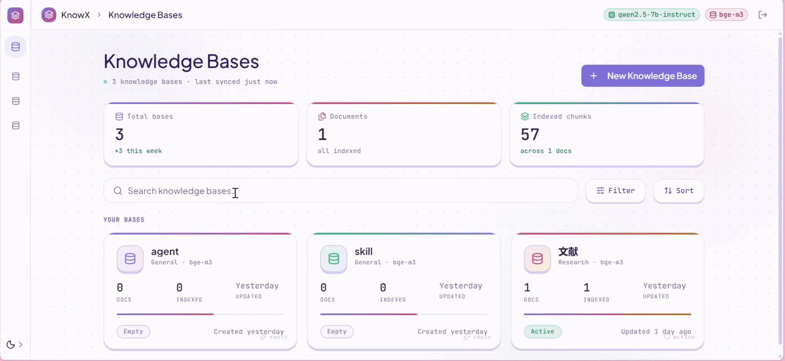
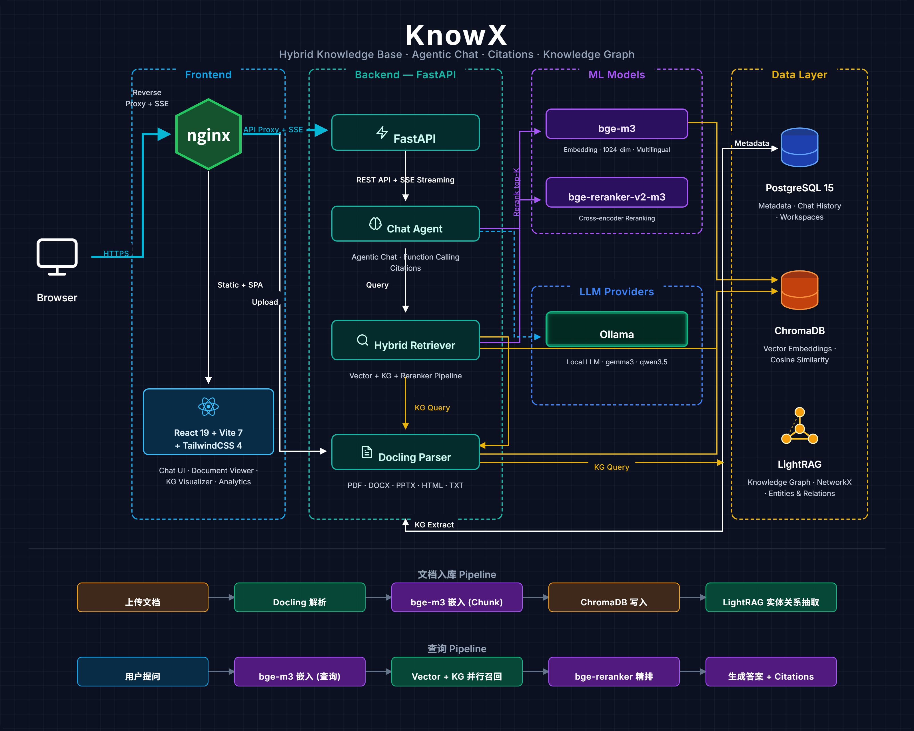

<div align="center">

# KnowX

### 面向研发文献与实验 SOP 的企业级知识库 RAG 系统

[](https://python.org)
[](https://react.dev)
[](https://fastapi.tiangolo.com)
[](https://docker.com)

**结构化解析 · 混合检索 · 知识图谱 · 引用溯源 · 多租户隔离**

</div>

---

## 项目定位

KnowX 是一个面向研发人员的企业级知识库问答系统，目标场景是：研发人员在项目中需要反复检索论文、技术报告、实验 SOP、试剂配比表等资料，而传统 RAG 在这类需求上存在明显短板。

|维度|传统 RAG|KnowX|
|-|-|-|
|文档解析|纯文本抽取，表格和版面信息丢失|Docling/Marker 结构化解析，保留页码、标题层级、表格、图片|
|多媒体信息|图片、表格常被忽略|表格/图片 caption 写入 chunk，纳入向量检索|
|检索策略|单向量相似度|向量 over-fetch + KG 上下文 + Cross-Encoder rerank|
|可追溯性|引用弱或无引用|引用 ID、页码、标题路径、文档跳转|
|工程落地|单用户 Demo 居多|鉴权、租户隔离、限流、Celery 队列|

---

## 产品演示

<div align="center">



</div>

---

## 系统架构

<div align="center">



</div>

架构分为五个层次：**前端工作台** → **FastAPI 接口层（JWT 鉴权）** → **Celery 异步队列（解析/索引/建图）** → **存储层（PostgreSQL + ChromaDB + LightRAG）** → **模型层（Embedding + Reranker + LLM）**。

**主链路说明：**

1. 用户登录后创建知识库，上传文档（可附加 `custom_metadata`）。
2. 后端将解析任务投递到 `parse_index_queue`，Celery Worker 异步执行。
3. 解析器统一输出 `ParsedDocument`：Markdown、chunk、图片、表格、页码、标题路径。
4. 系统对 chunk 去噪去重，图片/表格 caption 增强后写入 ChromaDB；同步构建 LightRAG 知识图谱。
5. 查询前先做上下文预算预检，按剩余 token 动态裁剪历史与检索 top-K，再进入精排与生成。
6. 查询时并行执行向量召回与 KG 上下文获取，Cross-Encoder 精排后交给 LLM 生成带引用答案。
7. 前端展示引用来源卡片、可跳转的文档阅读器和知识图谱可视化。

</details>

---

## 核心设计亮点

### 1. 双解析器 + 统一 `ParsedDocument` 契约

KnowX 支持 `Docling`（默认）和 `Marker` 两套解析器。

**设计重点不只是"支持两种解析器"，而是建立了统一输出契约：**

```
Docling  ──┐
            ├─→ BaseDocumentParser.parse() → ParsedDocument
Marker   ──┘        ↓
                去重 → Embedding → ChromaDB 入库
                      ↓
                  LightRAG 建图
```

无论上游使用哪种解析器，下游索引和检索链路完全一致，**避免了大量解析器分支散落在业务代码中**，系统可维护性显著提升。

|场景|推荐解析器|原因|
|-|-|-|
|表格密集、页码/标题结构重要|Docling（默认）|HybridChunker，结构化程度高，支持图表同页定位；单次解析显存约 4–8GB VRAM|
|公式/LaTeX 敏感，或显存紧张|Marker|Surya 引擎，~2–4GB VRAM|

---

### 2. 表格与图片纳入向量检索

传统 RAG 常将图片和表格丢弃，KnowX 通过以下方式让内容可被语义检索：

**表格处理流程：**

1. 解析器将表格导出为结构化 Markdown（保留行列维度）
2. LLM 对每张表格生成摘要：用途、关键列、核心数值
3. 摘要写回对应 chunk 文本 → 参与 embedding

**图片处理流程：**

1. 解析器抽取图片（每文档上限 50 张）
2. LLM 生成摘要（具体数字、标签、趋势描述）
3. 摘要追加至同页 chunk → 参与 embedding

效果：用户可用自然语言检索"试剂比例表""第 5 页的收益趋势图说明"等内容，**而不仅限于纯文本段落**。

---

### 3. 三层混合检索：向量 + KG + Cross-Encoder 精排

```
用户查询
  ├─ 向量召回：ChromaDB over-fetch（默认 top-20 候选）
  └─ KG 上下文：LightRAG hybrid 模式

       ↓  合并
  Cross-Encoder（bge-reranker-v2-m3）
  对每个 (query, chunk) 联合打分 → 精排

       ↓
  上下文预算控制（token 预检 / 历史裁剪 / 动态 top-K）

       ↓
  结构化上下文：KG 实体摘要 + 引用 chunk + 同页图片/表格
       ↓
  LLM 生成带引用答案
```

三层设计分别解决不同问题：

* **向量召回**：找到语义相关段落
* **LightRAG KG**：补充实体与关系上下文，适合跨文档、多跳问题
* **Cross-Encoder**：精准排除"语义相似但无法回答问题"的 chunk（相比 cosine similarity 精度更高）

---

### 4. 可追溯引用与文档跳转

每条回答中的引用使用 4 字符短 ID 标记（如 `[a3z1]`），并保留：

* 文件名、页码、标题路径
* 相关性评分
* 同页图片/表格引用（如 `[IMG-p4f2]`）

前端可根据引用 ID 直接跳转到文档阅读器中对应位置，**辅助用户核验答案来源**。

> 设计动机：在研发场景中，模型回答不是最终证据，**可审计的来源引用才是**。这对生物实验、技术报告解读等对准确性要求高的场景尤为关键。

---

### 5. 多租户隔离与安全设计

* **用户鉴权**：注册登录，密码 bcrypt 哈希，接口 JWT 访问控制
* **租户隔离**：每个知识库绑定 `owner_id`，跨租户访问统一返回 404
* **Redis 限流**：聊天、上传、解析均有限流；限制同一用户流式聊天单并发

---

### 6. Custom Metadata 业务维度过滤

上传文档时可附加自定义键值，例如：

```
doc_type = SOP
project  = antibody-purification
version  = v2.1
language = zh
```

这些元数据写入 ChromaDB 的 chunk 索引，检索 API 支持 `metadata_filter`，可先按业务维度过滤再做向量检索，**减少无关 chunk 进入 LLM 上下文**。

---

### 7. Agent Streaming Chat

聊天接口基于 SSE 流式输出，支持：

* 分析 → 检索 → 生成 → 完成 等状态事件（前端实时展示进度）
* `search_documents` 工具调用，将回答约束在检索结果上
* 工作区级自定义 system prompt
* 多轮对话历史
* 强制检索模式 `force_search`
* 支持时展示模型 thinking 内容
* 聊天历史持久化与消息评分

---

### 8. 上下文预算控制（Context Budget Control）

长文档、多轮对话和多路检索叠加后，最容易出现的问题不是“检索不到”，而是**上下文超限、成本失控、无关 chunk 挤占有效窗口**。KnowX 在生成前引入统一的上下文预算控制层，对输入 token 做预检，并按预算动态裁剪历史与检索结果。

**设计目标：**

- 在调用 LLM 前预估总输入 token，避免超限报错或静默截断
- 在多轮对话中优先保留最近且与当前问题相关的历史
- 根据剩余预算动态调整检索 top-K，平衡召回率与上下文利用率

**预算分配模型：**

## 预算分配模型

```
总上下文预算（模型上限 - 预留输出 token）
  ├─ 系统提示词 / 工作区自定义 prompt
  ├─ 多轮对话历史（按预算裁剪）
  ├─ 检索上下文（向量 + KG，动态 top-K）
  └─ 当前用户问题
```

### 三层控制策略

**输入 token 预检**

- 在检索完成后、调用 LLM 前，对 system prompt、历史消息、检索 chunk、当前 query 做 token 估算
- 若超出预算，进入裁剪流程，而不是直接调用模型

**按预算裁剪历史**

- 默认保留最近 N 轮完整对话
- 超出预算时，从最早轮次开始丢弃，或压缩为摘要占位
- 优先保留：当前问题、最近一轮用户输入、与引用相关的 assistant 回复

**动态调整 top-K**

- 向量召回默认 over-fetch（如 top-20），精排后保留 top-8
- 当历史较长或 system prompt 较重时，自动下调最终保留 chunk 数（如 8 → 5 → 3）
- 预算充足时维持默认 top-K，避免无谓损失召回
---

## 评测结果

### 整体评级：良好（GOOD）— 有明确的可改进项

拒答、引用格式、幻觉防范、语言匹配等机制性指标多为满分或接近满分。

**轨道 2 — 50 题 RAGAS 合成**（检索与答案质量补充）：

|指标|均值|说明|
|-|-|-|
|`context_recall`|0.897|检索召回尚可，长尾在表格与 metadata|
|`faithfulness`|0.818|偶发超出检索内容的发挥|
|`table_extraction` recall|0.63|表格/数值题最弱，为当前首要改进项|

</details>

## 技术栈

<details>
<summary><b>Backend</b></summary>

|技术|项目中的作用|
|-|-|
|FastAPI|REST API、SSE 流式聊天、健康检查|
|SQLAlchemy 2.0 + asyncpg|PostgreSQL 异步 ORM，管理用户、知识库、文档、聊天历史|
|Celery + Redis|解析索引与知识图谱构建异步化；Redis 同时用于限流与缓存|
|ChromaDB|向量数据库，按 workspace 隔离 collection|
|LightRAG|实体抽取、关系构建与知识图谱查询（基于文件存储，无需额外服务）|
|Docling / Marker|可切换文档解析器，统一输出 `ParsedDocument`|
|sentence-transformers|`BAAI/bge-m3` embedding + `BAAI/bge-reranker-v2-m3` rerank|
|ollama|本地 Ollama|
|PyJWT + bcrypt|用户注册登录、JWT 鉴权、密码哈希|

</details>


<details>
<summary><b>Infrastructure</b></summary>

|组件|说明|
|-|-|
|PostgreSQL|业务元数据与聊天历史|
|Redis|Celery Broker、限流、缓存|
|ChromaDB|向量索引|
|Docker Compose|全栈部署（PostgreSQL + ChromaDB + Backend + Frontend）|

</details>

---


